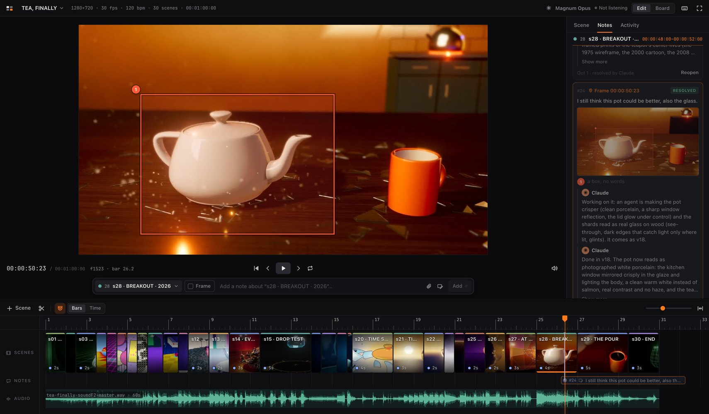
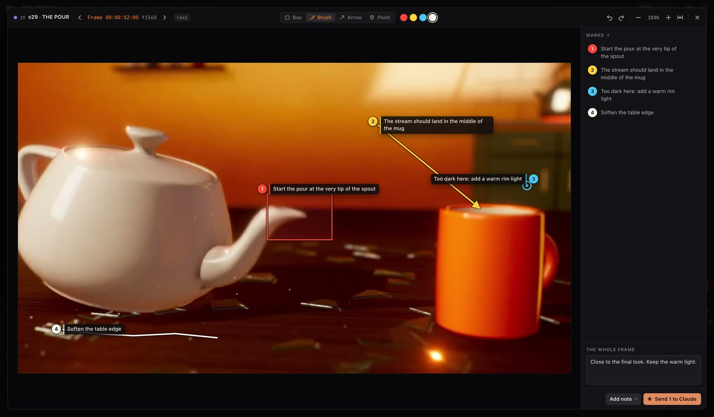

# Cutroom

**Direct your films with Claude.** Cutroom is a storyboard you and Claude edit together, laid out like
a video editor: a monitor, a timeline and an inspector. You watch the cut and leave notes on the exact
frame, drawing on it when words aren't enough. Claude picks the notes up, fixes the shots, puts the new
renders on the board and tells you what it did.



## The loop

1. **Plan.** Claude lays out the film as scenes on a timeline, each with a rough sketch, before anything
   is built. You react to the whole idea at once.
2. **Review.** You watch the cut, scrub it, step it frame by frame, and write notes about a scene or an
   exact frame. Send them when you're ready (⌘⏎).
3. **Fix.** Claude gets your notes the moment you send them, marks each one read and then working,
   renders, puts the new version on the board, replies and resolves. You see every step.

## What you get

- **An editor, not a document.** Scenes sit end to end on a timeline with thumbnails, colour lines, a
  waveform and a beat grid. Timecode, J/K/L shuttle, frame stepping and full-screen playback work as in
  any editor. Clips scrub instantly, and code sketches play live.
- **Notes on the exact frame.** Every note says what it's about: the whole board, a scene, or one frame.
  Attach references by dropping or pasting them.
- **Mark up a frame.** Double-click the picture to open the frame large. Draw boxes, arrows, brush
  strokes and points, each with its own words. Claude gets every mark's exact place and the picture as
  you saw it.
- **You see Claude work.** Each note shows where it stands: sent, read, working, replied, resolved. The
  top bar says what Claude is doing and on which shot. Every render becomes a version you can flip back
  to, and any change Claude makes can be reverted.
- **Claude never touches the page.** It works through an HTTP API made for agents, with a short manual
  it reads first, atomic changes with undo, and a listener that delivers your notes the moment you send
  them.



## Quick start

You need macOS, [Node](https://nodejs.org) 22 or later, ffmpeg (`brew install ffmpeg`) and Google
Chrome (for code-sketch posters and contact sheets). There are no packages to install.

```bash
git clone <this repository> ~/dev/storyboard
~/dev/storyboard/sb start          # runs in the background; sb stop stops it
open http://127.0.0.1:8840
```

To run it like an app, with its own window and Dock icon, install it from the browser: Chrome's install
button in the address bar, or Safari's File → Add to Dock. The full-screen button at the top right
fills the screen with the editor.

### Connect Claude

In Claude Code, link the skill so every session can use Cutroom:

```bash
ln -s ~/dev/storyboard/skill ~/.claude/skills/storyboard
```

Then ask Claude to plan a film on the storyboard. (If you cloned somewhere else, change the path to `sb`
in `skill/SKILL.md`.) Any other agent can start from `http://127.0.0.1:8840/agent`.

## A tour of the editor

- **Monitor.** Plays the cut, with the soundtrack as the master clock. Scenes with a render play that
  clip or show that still; scenes without one show a storyboard card with their title, picture and
  sound. The timecode reads hours:minutes:seconds:frames; click it to type a time (2115 is
  00:00:21:15, +12 is twelve frames on). J K L play backwards, stop and play forwards (press again for
  2×, 4×, 8×). ⇧F plays it full screen.
- **Timeline.**
  - Scenes sit end to end. Drag one to reorder it.
  - Drag a scene's right edge to change its length. With snapping on, the length lands on the beat
    grid, or on cuts and markers. Alt-drag an edge to roll the cut between two scenes instead.
  - Pinch or ⌘-scroll to zoom. The ruler counts bars when the board has a tempo, or timecode.
  - Each scene has a colour line on top: its own colour, or one the editor picks so neighbours differ.
  - The Notes lane shows every open note in time. The Audio lane shows the soundtrack's waveform.
  - Right-click the ruler to add a marker.
- **Notes to Claude.** Write in the bar under the monitor (press C).
  - It always shows what the note is about: the scene you're in (click to pick another, or the whole
    board). Turn on **Frame** (F) for the exact frame you're on.
  - **Mark up a frame** (double-click the picture, A, or the markup button): the frame opens large over
    the editor, zoomable. Draw boxes, brush strokes, arrows and points; each mark is numbered and asks
    what it's about ("this area is empty, looks bad"). ⇧ squares a box or straightens an arrow, and a
    selected mark can be reshaped. ← → step frames. It saves as one note.
  - Attach references: the paperclip, a drop, or ⌘V a screenshot. Stills and clips show as thumbnails.
  - Enter adds a note as a draft. Claude sees nothing until you press **Send to Claude** (⌘⏎); sending
    means it can start work (without re-rendering, unless a note asks for that).
  - Open notes sit on the timeline with their words: a frame note at its frame, a scene note across its
    scene. Marks show on the picture on their own frame only.
  - The Notes panel groups notes by scene, in the order of the cut; picking one takes you to it.
    ⇧↑ ⇧↓ jump from note to note.
- **Versions.** Every still, clip or sketch on a scene is kept, oldest to newest; click one to make it
  the one that plays. Drop a file onto a scene, the monitor or the Versions list to add one, onto empty
  timeline for a new scene, or onto the Audio lane for the soundtrack.
- **Board view (G).** The classic storyboard wall: one panel per scene, with the text underneath. Drag
  panels to reorder.
- **Claude, in the top bar.** Who owns the board, whether it's listening for your notes, and what it's
  doing, on which shot, and how far along (that shot shows it on the timeline too).
- **Activity.** Every change, yours or Claude's. Any agent change can be **reverted**: it shows what the
  revert will do first, and ⌘Z undoes the revert.
- **Boards.** The switcher lists boards newest first, with their owner, a dot when an agent is
  listening, and how many notes wait on you. Archive a board to hide it, or delete it to the Trash.

Press `?` in the editor for every shortcut.


## For agents

An agent never uses the page. `GET /agent` serves a short overview (the current boards, the rules and
one line per capability); `GET /agent/help/<topic>` serves the detail for one topic, and
`/agent/help/all` the complete manual. (`curl http://127.0.0.1:8840/` gives the overview; browsers get
the editor.) `sb` is the same API as a command line. The API covers:
- **Reading:** a shot-list view of a board, one scene, the notes, the change log. Reading a board also
  lists anything still to fill in, so boards stay current.
- **Sketching:** a rough version of a shot, so a whole idea can be laid out before anything is rendered.
  It can be:
  - a code sketch: JS that draws the frame from `t`, which plays live in the editor;
  - an SVG drawing on storyboard paper;
  - any still or clip.

  To add one, save `s3.js`, `s3.svg`, `s3.png` or `s3.mp4` into the board's `sketches/` folder; saving
  it again updates it. The API works too. A sketch stays as an earlier version once the real render
  arrives.
- **Seeing:** a contact sheet of the whole board, frames across a scene, and the exact frame a note
  points at with the user's marks drawn on it. The sheets are drawn natively by `tools/sheet.swift`.
- **Changing:** atomic batches of ops, with dry runs, a check that the board hasn't changed since you
  read it, and ops that undo each batch.
- **Renders and sound:** put a still or a clip on a scene from a path on disk, with the command that
  made it; cut a whole film into a new version of every scene in one call; set the soundtrack.
- **Talking to you:** a status line in your top bar (optionally about one shot, with progress), and
  moving your playhead to what it's talking about. Replies and notes can carry files.
- **Listening:** `sb wait` returns when you send notes, and rides out server restarts.

The server started by `sb start` restarts itself when its own code changes (after checking the new code
parses, and falling back if it doesn't start), so agents never talk to an out-of-date server.

How agents find out about it:
- `AGENTS.md` and `CLAUDE.md` point any agent working in this folder to the manual.
- `skill/SKILL.md` is a Claude Code skill for agents working anywhere else (see Connect Claude above).
- A `.storyboard` file in a film's folder (`sb use <board>`) names its board, and a board's `project`
  field points back at the film's folder.

## How it works

- `server.js` keeps each open board in memory and applies every change as an op.
  - It saves `boards/<slug>/board.json` after each op.
  - It appends each op to `log.jsonl`.
  - It sends each op to every open page over Server-Sent Events.
  - It also notices when `board.json` is edited by hand.
- `lib/ops.js` is the only code that changes a board. The server, the CLI and the browser all use it,
  so the same ops in the same order always give the same board. Each op also returns its inverse, which
  is what undo uses.
- Media (`lib/media.js`):
  - Clips get a 1080p H.264 proxy with a keyframe every 12 frames, so scrubbing is instant.
  - Every clip gets a poster and a 10-frame filmstrip for the timeline.
  - Soundtracks get a peaks file for the waveform.
- The editor (`web/`) is plain JavaScript modules and CSS, with no build step and no dependencies.
- Only this machine can reach the server: it listens on 127.0.0.1 and answers only to local host names.
