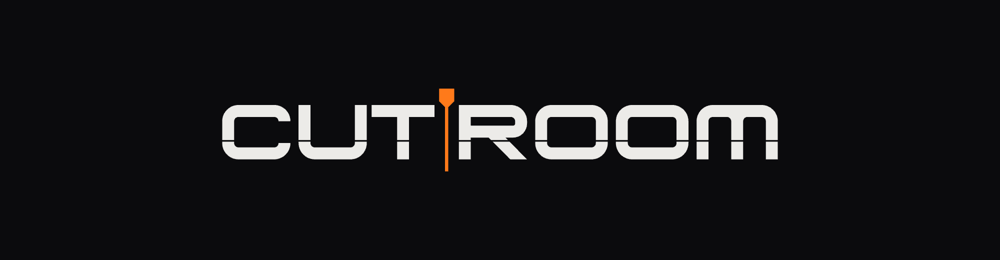
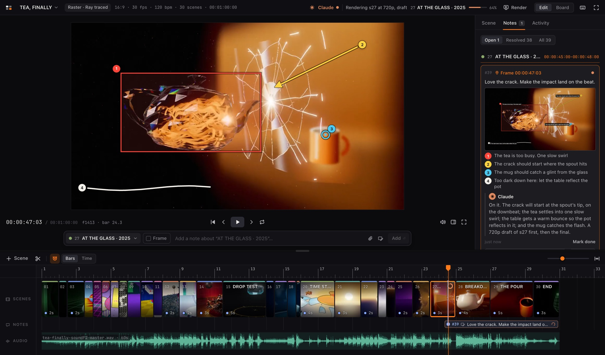
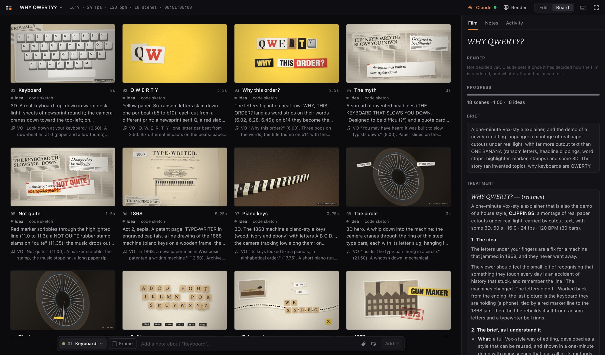
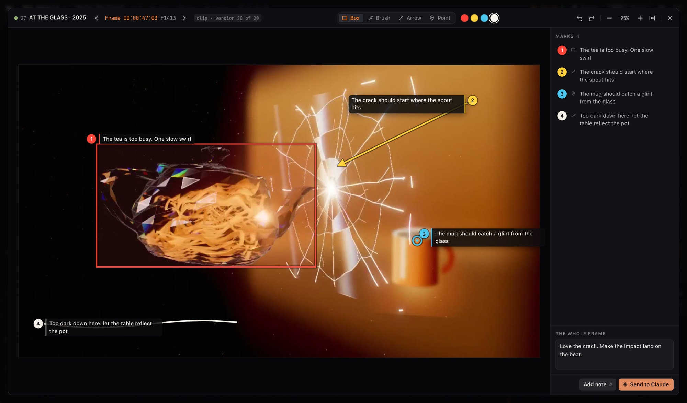
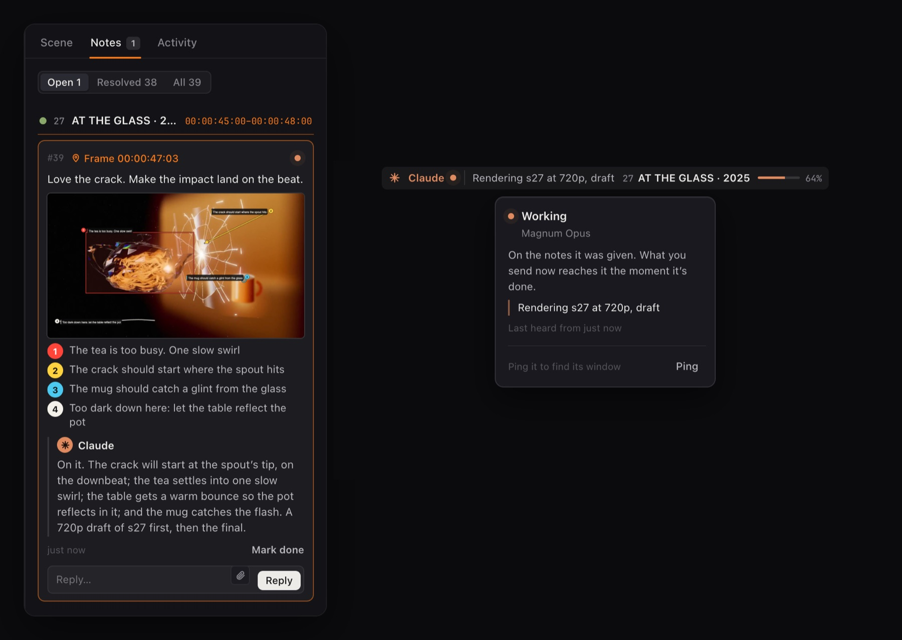
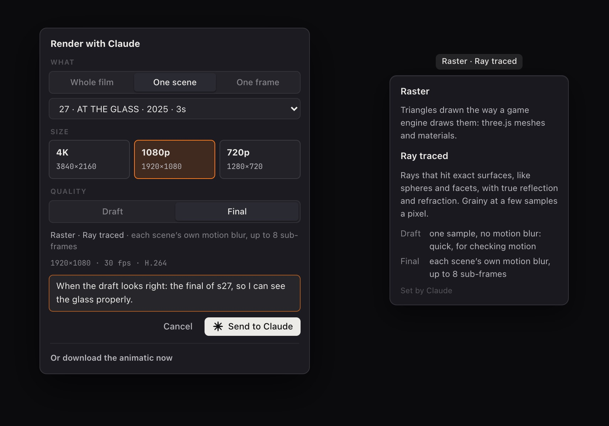
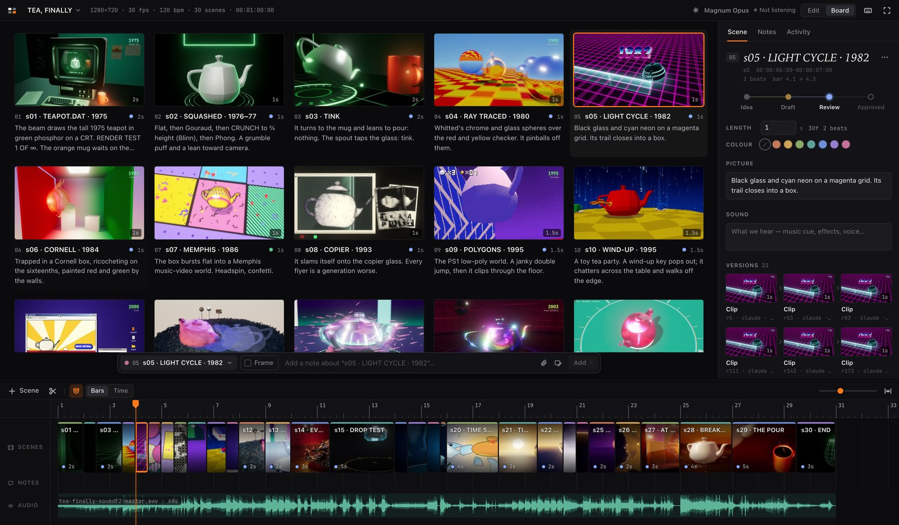

<h3 align="center">Direct your films with Claude.</h3>

<p align="center">
  A storyboard and cutting room you share with Claude. Watch the cut, point at what's wrong on the exact
  frame, and Claude fixes the shot, renders it and puts the new version on the board, saying what it's
  doing at every step.
</p>

<p align="center">
  <a href="#the-loop">The loop</a> ·
  <a href="#quick-start">Quick start</a> ·
  <a href="#a-tour-of-the-editor">The editor</a> ·
  <a href="#for-agents">For agents</a>
</p>



Claude can write a whole film: the code for every shot, the timing, the sound. Directing it is the hard
part. In a chat window you describe a frame in words ("the thing on the left, about two seconds in"),
Claude guesses, and soon neither of you knows which render is which.

Cutroom gives that work a room. The film sits on a timeline you can play, scrub and step frame by frame.
You say what's wrong by drawing on the frame itself. Claude gets the exact frame and every mark, answers
in the note's thread, and shows you what it's doing while it does it. Every render becomes a version on
its scene, so nothing gets lost.

## The loop

### 1. Claude thinks it through, then storyboards it

Give Claude an idea. Before anything is built, it writes the treatment: the idea, the style, the shape of
the film, every scene and how it will be made. Then it lays the film out as scenes on a timeline, each
with a sketch: a code sketch that plays live in the editor, a drawing on storyboard paper, or a still.
You react to the whole film while changing it is still cheap.


<p align="center"><sub>WHY QWERTY?, laid out as eighteen code sketches timed to its voice-over, before any real render.</sub></p>

### 2. You point at what's wrong

Watch the cut with its soundtrack, scrub it, step it frame by frame. When something is off,
double-click the picture: the frame opens large, and you draw on it. Boxes, arrows, brush strokes and
points, each with its own words. Claude gets the exact frame, the version it's from, where every mark
sits and the picture as you saw it.



Notes wait until you press **Send to Claude** (⌘⏎), so you can watch the whole cut and send everything at
once. A note can be about the whole film, one scene or one frame, and carry references: drop in a still,
a clip or a screenshot.

### 3. Claude answers, and you watch it work

A Claude session listening on the board gets your notes the moment you send them. Each note shows where
it stands (sent, read, being worked on, answered, done), and Claude replies in its thread. The light
beside Claude in the top bar is green while it listens and orange while it works, with what it's doing,
on which shot and how far along. Click it to ping the session: it answers in its own window, so you know
which terminal has the board.



New renders land on their scene as versions, captioned with what changed and the quality they were made
at. The cut plays the newest; click an older one to flip back. Anything Claude changes on the board can be
reverted.

### 4. You decide what gets rendered

Rendering is the expensive part, so it's your call. Ask for the whole film, one scene or one frame, at
4K, 1080p or 720p, as a draft or the final. What draft and final mean depends on how the film is made, so
Claude records the film's render type (2D, three.js, ray marched, ray traced, path traced, an edit, a
screen capture) and what each quality is. A ray-marched film's draft is 8 samples a pixel, grainy but fine
for checking motion; its final is 64. You see it beside the title, and in every render request.



## The whole film at once

Board view is the classic storyboard wall, one panel per scene with where it stands and its notes. Beside
it, the film: how it's rendered, how far along it is, the brief, the treatment and its settings.



And it's built like an editor, not a document: a monitor with timecode, J/K/L shuttle and full-screen
playback; a timeline with thumbnails, a waveform, a beat grid and snapping; scenes you reorder and trim
by dragging. It runs on your Mac: no account, no build step, no npm packages, and boards are plain
folders on disk.

## Quick start

You need macOS, [Node](https://nodejs.org) 22 or later, ffmpeg (`brew install ffmpeg`) and Google
Chrome (for code-sketch posters and contact sheets). There are no packages to install.

```bash
git clone https://github.com/kanin-design/Cutroom.git ~/dev/storyboard
~/dev/storyboard/sb start          # runs in the background; sb stop stops it
open http://127.0.0.1:8840
```

To run it like an app, with its own window and Dock icon, install it from the browser: Chrome's install
button in the address bar, or Safari's File → Add to Dock.

### Connect Claude

In Claude Code, link the skill so every session can use Cutroom:

```bash
ln -s ~/dev/storyboard/skill ~/.claude/skills/storyboard
```

Then ask Claude to plan a film on the storyboard. Or start one in the editor: say what the film is, pick
its shape, and Cutroom gives you a message to paste into any Claude Code session, which takes the board
over from there. (If you cloned somewhere else, change the path to `sb` in `skill/SKILL.md`.) Any other
agent can start from `http://127.0.0.1:8840/agent`.

## A tour of the editor

Two views, each with its own side pane: **Edit** (one scene at a time, with the picture and the timeline)
and **Board** (the whole film as a wall). G switches between them. Drag the side pane's edge to resize it;
each view keeps its own width, and a double-click on the edge gives the default back. Press `?` in the
editor for every shortcut.

<details>
<summary><b>Every panel and control</b></summary>

- **Top bar.** The film's title, how it's rendered once Claude has decided (Ray marched, say; hover it for
  what that means and what draft and final mean, click it for the film), and its shape, frame rate,
  tempo, scenes and length.
- **Edit's side pane: the scene.** The scene you selected, or else the one under the playhead (it says
  so, and follows the playhead as the cut plays, except while you type in it). Its status, the version
  playing and the quality it was rendered at, its length and colour, what we see and hear, and every
  version.
- **Board's side pane: the film.** How it's rendered; where it stands (its scenes by status, its length,
  and the notes waiting for you); the brief; the treatment; and its settings, folded with their values
  beside them: the project folder, shape, frame rate, tempo and soundtrack.
- **Monitor.** Plays the cut, with the soundtrack as the master clock. Scenes with a render play that
  clip or show that still; scenes without one show a storyboard card with their title, picture and
  sound. The timecode reads hours:minutes:seconds:frames; click it to type a time (2115 is
  00:00:21:15, +12 is twelve frames on). J K L play backwards, stop and play forwards (press again for
  2×, 4×, 8×); ← → step a frame. ⇧F, or the button under the picture, plays it full screen. For a bigger
  picture without going full screen, hide the side pane (I), or drag the divider above the timeline
  (double-click it for a big monitor and back).
- **Timeline.**
  - Scenes sit end to end. Drag one to reorder it.
  - Drag a scene's right edge to change its length. With snapping on, the length lands on the beat
    grid, or on cuts and markers. Alt-drag an edge to roll the cut between two scenes instead.
  - Pinch or ⌘-scroll to zoom. The ruler counts bars when the board has a tempo, or timecode.
  - Each scene has a colour line on top: its own colour, or one the editor picks so neighbours differ.
  - The Notes lane shows every open note in time. The Audio lane shows the soundtrack's waveform.
  - Right-click the ruler to add a marker.
- **Notes to Claude.** Write in the bar under the monitor (press C).
  - It always shows what the note is about: the scene you're in (click to pick another, or the whole
    board). Turn on **Frame** (F) for the exact frame you're on.
  - **Mark up a frame** (double-click the picture, A, or the markup button): the frame opens large over
    the editor, zoomable. Draw boxes, brush strokes, arrows and points; each mark is numbered and asks
    what it's about. ⇧ squares a box or straightens an arrow, and a selected mark can be reshaped. ← →
    step frames. **Add note** keeps it with your other notes, or send it straight away.
  - Attach references: the paperclip, a drop, or ⌘V a screenshot. Stills and clips show as thumbnails.
  - Enter adds a note. Write as many as you like: Claude sees none of them until you press **Send to
    Claude** (⌘⏎), which sends every note you haven't sent yet, and means it can start work (without
    re-rendering, unless a note asks for that). A note not sent has a hollow light and a dashed edge.
  - Each note has a light for where it stands (sent, read, being worked on, answered, done); hover it to
    read which.
  - Open notes sit on the timeline with their words: a frame note at its frame, a scene note across its
    scene. Marks show on the picture on their own frame only.
  - The Notes panel groups notes by scene, in the order of the cut; picking one takes you to it.
    ⇧↑ ⇧↓ jump from note to note.
  - Right-click the Audio lane for a note on the soundtrack, at that moment or about all of it.
- **Render (R).** Ask Claude for a render, choosing:
  - **What:** the whole film, one scene (any scene, from a list), or one frame: the frame under the
    playhead, as a still. A frame is the cheapest way to judge the look of an expensive, ray-traced film.
  - **Size:** 4K, 1080p or 720p, in the board's shape and frame rate.
  - **Quality:** draft or final, meaning what the board's render says they mean. Before Claude has said,
    draft is the project's quickest settings that still show the look, and final its full settings. A
    final 4K is the master, in 10-bit HEVC; other clips are H.264, and a frame is a PNG.

  Add anything else Claude should know. Claude says how long a render will take before starting anything
  over about ten minutes. The request goes straight to Claude and shows in Notes like any note, and the
  button carries a dot while one is open (spinning while Claude renders). Open it again to see where your
  requests stand, or to cancel one. Or download the animatic: the current versions cut together here, in
  a moment, with no Claude needed.
- **Versions.** Every still, clip or sketch on a scene is kept, oldest to newest; click one to make it
  the one that plays. A render says the quality it was made at (final, 64 samples) when Claude records
  it. Drop a file onto a scene, the monitor or the Versions list to add one, onto empty timeline for a
  new scene, or onto the Audio lane for the soundtrack.
- **Board view (G).** The storyboard wall, the whole height of the window: one panel per scene, each with
  where it stands (its status, a sketch or the render's quality, its open notes) and its text
  underneath. Drag panels to reorder; double-click one to open it in Edit.
- **Claude, in the top bar.** A light beside Claude:
  - green while its session listens for your notes;
  - orange while it works on notes you sent (what you send meanwhile reaches it the moment it's done);
  - red when it isn't listening;
  - grey when no session has the board yet.

  Hover it for a card saying which session it is, what that means and what it's doing. Then what it's
  doing, on which shot, and how far along (that shot shows it on the timeline too). Click it to **ping**
  the session: it answers in its own window. With nobody listening, the click gives you a message to
  paste into a Claude Code session: it hands the board over, or gets its session back on it.
- **Activity.** Every change, yours or Claude's, with a run of the same kind of change (old versions taken
  off one by one, say) shown once, with how many more. Any agent change can be **reverted**: it shows what
  the revert will do first, and ⌘Z undoes the revert.
- **Boards.** The switcher lists boards newest first, with their owner, a green light when an agent is
  listening, how many notes wait on you, and how many you wrote there but haven't sent. Each board's ⋯
  renames it, opens its settings, archives it or deletes it to the Trash.
  - **A new board starts from the idea:** say what the film is, pick its shape (16:9, 9:16, 1:1, 4:5, 4:3,
    2.39:1 or any other) and frame rate, and it opens with the message that hands it to Claude, who
    fills in the rest and lays the idea out. A board has a shape, not a resolution: renders come in
    whatever size you ask for.
  - **Board settings** (the menu, or click the shape line in the top bar) open the film pane in the
    Board view, settings unfolded.
  - **Render:** how the film is rendered: 2D, raster (three.js), ray marched, ray traced, path traced, an
    edit of existing clips, or a screen capture (or a mix), with what draft and final mean for it. Claude
    sets it once it has decided, and keeps it true; you see it beside the title, in the film pane, and in
    the render menu next to the quality you pick.

</details>

## For agents

An agent never uses the page. `GET /agent` serves a short overview (the current boards, the rules and
one line per capability); `GET /agent/help/<topic>` serves the detail for one topic, and
`/agent/help/all` the complete manual. (`curl http://127.0.0.1:8840/` gives the overview; browsers get
the editor.) `sb` is the same API as a command line. The API covers:
- **Reading:** a shot-list view of a board, one scene, the notes, the change log. Reading a board also
  lists anything still to fill in, so boards stay current.
- **Sketching:** a rough version of a shot, so a whole idea can be laid out before anything is rendered.
  It can be:
  - a code sketch: JS that draws the frame from `t`, which plays live in the editor;
  - an SVG drawing on storyboard paper;
  - any still or clip.

  To add one, save `s3.js`, `s3.svg`, `s3.png` or `s3.mp4` into the board's `sketches/` folder; saving
  it again updates it. The API works too. A sketch stays as an earlier version once the real render
  arrives.
- **Seeing:** a contact sheet of the whole board, frames across a scene, and the exact frame a note
  points at with the user's marks drawn on it. The sheets are drawn natively by `tools/sheet.swift`.
- **Changing:** atomic batches of ops, with dry runs, a check that the board hasn't changed since you
  read it, and ops that undo each batch.
- **Renders and sound:** put a still or a clip on a scene from a path on disk, with the command that
  made it and the quality it was rendered at; cut a whole film into a new version of every scene in one
  call; set the soundtrack.
- **Talking to you:** a status line in your top bar (optionally about one shot, with progress), and
  moving your playhead to what it's talking about. Replies and notes can carry files.
- **How the film is rendered:** once decided, the board's render type and what draft and final mean in
  this film (`sb board render.type=raymarch render.final="64 samples a pixel"`). Requests repeat it.
- **Render requests:** when you ask for a render, Claude gets a note that says exactly what to render, at
  what size, quality and encoding, and how to hand it back.
- **Listening:** `sb wait` returns when you send notes, and rides out server restarts. A ping from the
  editor returns it too, so the session can say which window it is.

The server started by `sb start` restarts itself when its own code changes (after checking the new code
parses, and falling back if it doesn't start), so agents never talk to an out-of-date server.

How agents find out about it:
- `AGENTS.md` and `CLAUDE.md` point any agent working in this folder to the manual.
- `skill/SKILL.md` is a Claude Code skill for agents working anywhere else (see Connect Claude above).
- A `.storyboard` file in a film's folder (`sb use <board>`) names its board, and a board's `project`
  field points back at the film's folder.

## How it works

- `server.js` keeps each open board in memory and applies every change as an op.
  - It saves `boards/<slug>/board.json` after each op.
  - It appends each op to `log.jsonl`.
  - It sends each op to every open page over Server-Sent Events.
  - It also notices when `board.json` is edited by hand.
- `lib/ops.js` is the only code that changes a board. The server, the CLI and the browser all use it,
  so the same ops in the same order always give the same board. Each op also returns its inverse, which
  is what undo uses.
- Media (`lib/media.js`):
  - Clips get a 1080p H.264 proxy with a keyframe every 12 frames, so scrubbing is instant.
  - Every clip gets a poster and a 10-frame filmstrip for the timeline.
  - Soundtracks get a peaks file for the waveform.
- Contact sheets and frame grids (`lib/sheet.js`) are drawn natively by `tools/sheet.swift`.
- The editor (`web/`) is plain JavaScript modules and CSS, with no build step and no dependencies.
- Only this machine can reach the server: it listens on 127.0.0.1 and answers only to local host names.
- `npm test` runs the tests: the board model, what agents read, and the agent API, the `sb` command and
  the sketches folder against a throwaway server and boards folder. They need ffmpeg and Chrome too.
